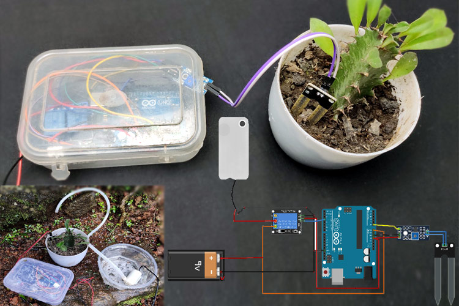

# Sistema de Irrigação com Arduino

Este é um exemplo de um sistema de irrigação controlado por Arduino. O sistema usa um Arduino Uno, um módulo de relé, um sensor de umidade do solo e uma bomba de água para automatizar a irrigação de plantas com base na umidade do solo.

Exemplo do Sistema de Irrigação
<h1 align="center">
    
</h1>

## Componentes Necessários

- Arduino Uno (ou outro modelo compatível)
- Módulo de relé (para controlar a bomba de água)
- Sensor de umidade do solo
- Bomba de água
- Fonte de energia externa (para a bomba de água)
- Fios jumper (para conexões)
- Protoboard (ou placa de circuito impresso)
- Mangueiras e conectores para a irrigação

## Conexões

1. Conecte o pino de 5V do Arduino ao módulo de relé (VCC) e ao sensor de umidade do solo (VCC).
2. Conecte o GND do Arduino ao GND do módulo de relé, ao sensor de umidade do solo e à bomba de água.
3. Conecte um pino digital do Arduino (por exemplo, pino 7) ao pino de controle do módulo de relé.
4. Conecte o pino de sinal do sensor de umidade do solo a um pino analógico do Arduino (por exemplo, A0).
5. Conecte a bomba de água à fonte de energia externa e certifique-se de que os fios de alimentação não excedam a capacidade do módulo de relé.

## Uso

1. Faça o upload do código fornecido para o Arduino usando a IDE do Arduino ou outra plataforma de programação compatível.
2. Monte as conexões de acordo com o esquema fornecido.
3. Certifique-se de que a fonte de energia externa da bomba de água esteja conectada e funcionando corretamente.
4. Ligue o Arduino.
5. O sensor de umidade do solo irá medir continuamente a umidade do solo.
6. Se o valor de umidade estiver acima do limiar definido no código (variável `moistureThreshold`), a bomba de água será ligada e a irrigação será ativada.
7. Se o valor de umidade estiver abaixo do limiar, a bomba de água será desligada e a irrigação será interrompida.
8. Acompanhe as mensagens exibidas no monitor serial da IDE do Arduino para verificar o status do sistema de irrigação.

## Personalização

- Você pode ajustar o limiar de umidade do solo (`moistureThreshold`) no código para atender às necessidades específicas das suas plantas.
- Adicione outras funcionalidades, como temporizadores, configurações de horário de irrigação, ajuste automático do limiar de umidade, etc., para personalizar o sistema conforme necessário.
